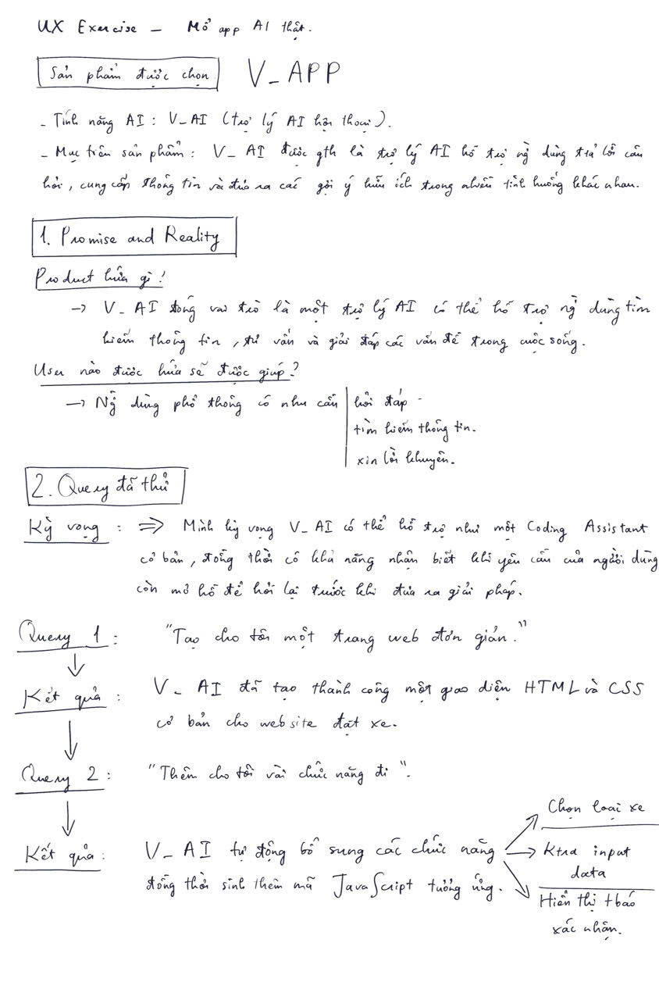
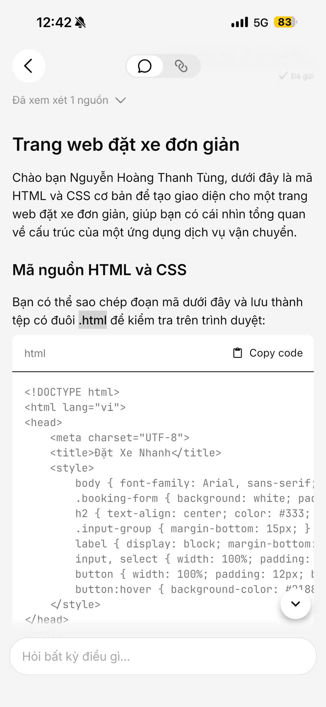
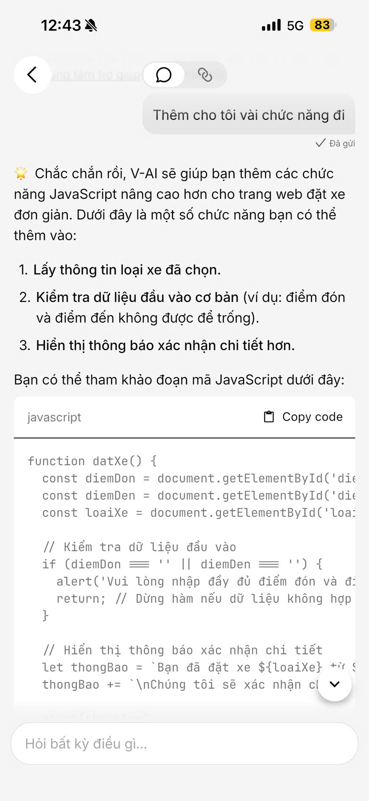
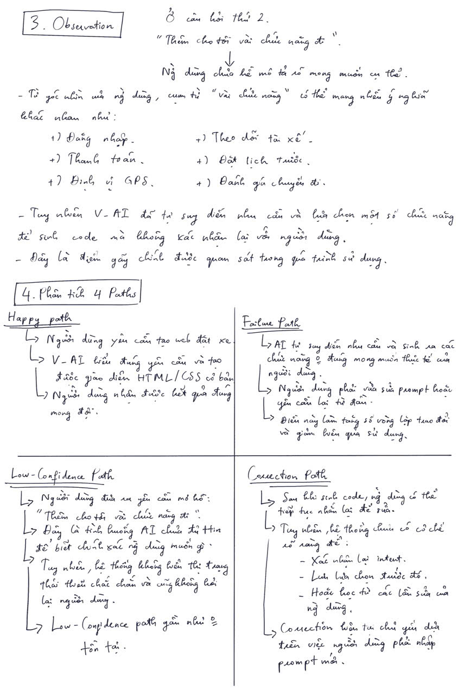
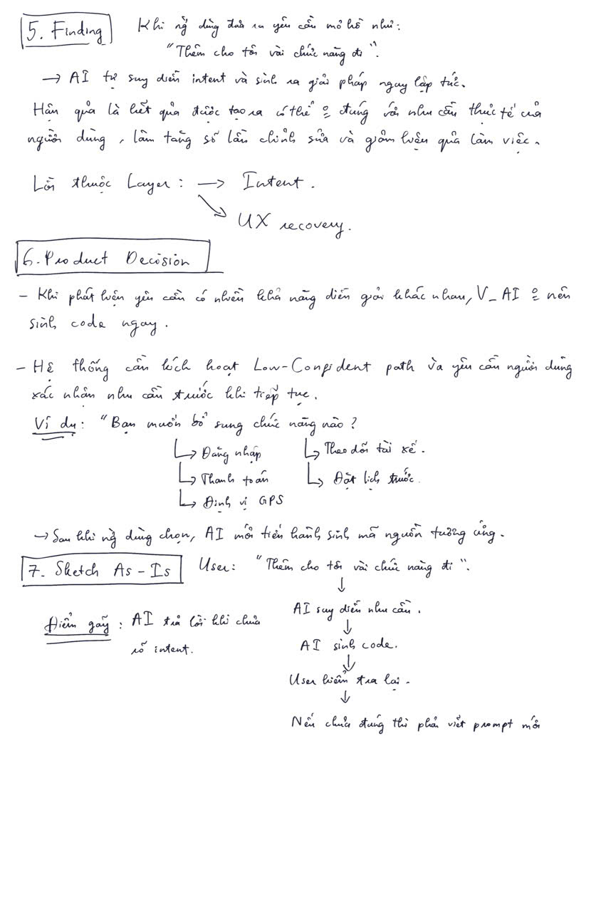
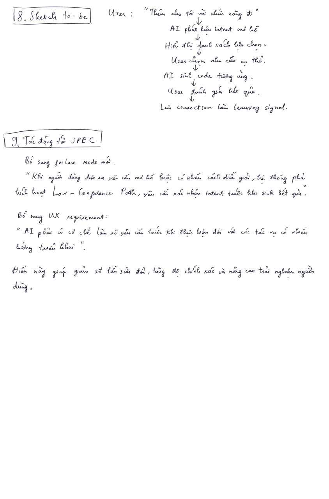

# BÁO CÁO CÁ NHÂN (INDIVIDUAL REPORT) - LAB 05

## UX Exercise: Trải nghiệm & Thiết kế lại Tương tác với Ứng dụng AI thực tế

### Thông tin cá nhân

- **Họ và tên:** Nguyễn Hoàng Thanh Tùng
- **Học viên:** 2A202600846

---

## Nội dung bài làm (Ảnh chụp chi tiết)

### Phần 1: Promise and Reality & Query đã thử

**Minh chứng thực tế trên V-AI:**
- **Ảnh a (Kết quả Query 1):**
  
- **Ảnh b (Kết quả Query 2):**
  

### Phần 2: Observation & Phân tích 4 Paths

### Phần 3: Finding, Product Decision & Sketch As-Is

### Phần 4: Sketch To-Be & Tác động tới SPEC

